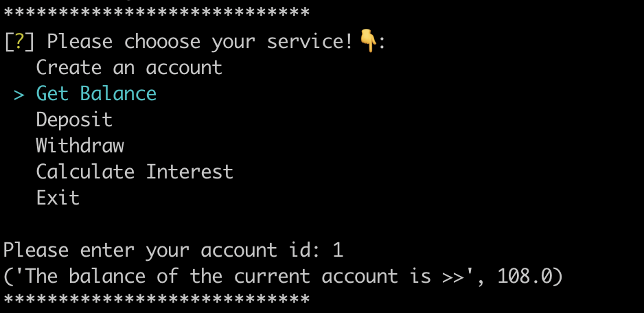
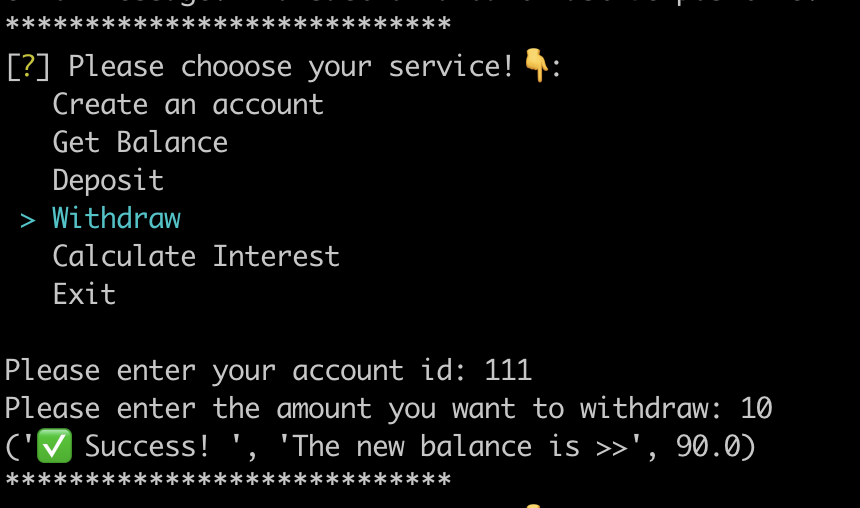

## Assignment 1

### 1. gRPC Server (server.py)

- Use the following command line to generate the corresponding `bank_pb2_grpc.py` and `bank_pb2.py` from `bank.proto`.

  ```shell
  python -m grpc_tools.protoc -I. --python_out=. --grpc_python_out=. bank.proto
  ```

- The server should listen on port 50051. 

  ```python
   # ...
   bank_pb2_grpc.add_BankServiceServicer_to_server(BankService(), server)
   server.add_insecure_port('localhost:50051')
   #..
  ```

- The server exposes the following RPC methods:

  > These functions are implemented in the `BankService` class within `server.py`, each with built-in error handling.

  1. CreateAccount / 2. GetBalance /3. Deposit / 4. Withdraw / 5. CalculateInterest

- Handle errors : See "5. Error Handling"

### 2. Redis Integration

This project uses Redis to store a hash structure. The structure is as follows:

```lua
Key: "001" (account_id)
--------------------------
| Field         | Value   |
|--------------|---------|
| balance      | 0       |
| account_type | savings |
--------------------------
```

### 3. Client Application

- `client.py`  provides following functions that interact with the gRPC server

  - create_account (account_id: str, account_type: str) -> str / get_balance(account_id: str) -> float / ...(5 methods)
  - Successful operations have corresponding `confirmation messages` (response.message).
  - Failed operations have corresponding `error codes` and `error messages`.

  ```python
  # For example: 
  def deposit(stub, account_id: str, amount: float):
      try:
          response = stub.Deposit(bank_pb2.DepositRequest(
              account_id=account_id, amount=amount))
          return (response.message, "The new balance is >>", response.balance)
      except grpc.RpcError as e:
          return f"❌Error:\n error code: {e.code()},\nerror message: {e.details()}"
  ```


- Implementation: See "6. Results Display"

### 4. Concurrency Handling

- [x] Design the server to handle multiple clients simultaneously.

  ```python
   server = grpc.server(futures.ThreadPoolExecutor(max_workers=10))
  ```

​		 This line creates a thread pool with a maximum of **10 worker threads**.

- [x] Implement locking mechanisms to ensure data consistency, especially during updates to account balances.

  In server.py,  "**Lock**"is used to **synchronize access** to a shared resource, ensuring that only one thread can execute the critical section at a time.

  ```python
   def __init__(self):
      		# 1️⃣ This creates a lock, preventing multiple threads from modifying shared resources simultaneously
          self.lock = threading.Lock()
  
      def CreateAccount(self, request, context):
          r = redis.Redis(host='localhost', port=6379, db=0)
          # 2️⃣ This acquires the lock before executing the critical section.
          with self.lock:
          	 #... 
             # ...
             # ... 
  ```

### 5. Error Handling 

1. Define each error message's `message` through an `Enum` class. This eliminates the need to repeatedly write long messages.

   ```python
   class MESSAGE(Enum):
       SUCCESS = '✅ Success! '
       ACCOUNT_ALREADY_EXISTS = 'Account already exists'
       ACCOUNT_NOT_FOUND = 'Account not found. Please check the account ID.'
       NEGATIVE_DEPOSIT = 'Transaction amount must be positive.'
       INSUFFICIENT_FUNDS = 'Insufficient funds for the requested withdrawal.'
       INVALID_INREREST_RATE = 'Annual interest rate must be a positive value.'
   ```

   In each function:

   ```python
   def Deposit(self, request, context):
           # ...
       		# ...
               #   Negative deposit
               if request.amount <= 0:
                   context.set_code(grpc.StatusCode.INVALID_ARGUMENT)
                   context.set_details(MESSAGE.NEGATIVE_DEPOSIT.value)
                   # ...
   				# ...
       		# ...
   ```

   |                                             | CreateAccount             | GetBalance | Deposit | Withdraw | CalculateInterest |
   | ------------------------------------------- | ------------------------- | ---------- | ------- | -------- | ----------------- |
   | ⚠️**Account not found**                      | (Account already  exists) | ✅          | ✅       | ✅        | ✅                 |
   | **⚠️Negative deposit or withdrawal amounts** |                           |            | ✅       | ✅        |                   |
   | **⚠️Insufficient funds for withdrawals**     |                           |            |         | ✅        |                   |
   | **⚠️ Invalid interest rate values**          |                           |            |         |          | ✅                 |


### 6. Results Display


| Welcome message                                                  | Exit Message                                                  |
| ---------------------------------------------------------------- | ------------------------------------------------------------- |
|  |  |


|         | Create a new account                                         | Get Balance                                                  | Deposit                                                      | Withdraw                                                     | Caculate Interest                                            |
| ------- | ------------------------------------------------------------ | ------------------------------------------------------------ | ------------------------------------------------------------ | ------------------------------------------------------------ | ------------------------------------------------------------ |
| Success |  |  |  |  |  |
| Fail    | Account  Already Exists<br /> | Account not found!<br> | Account not Found<br> | Account not Found<br>! | Account not Found<br> |
|         |                                                              |                                                              | Negative Deposit Amount<br> | Negative Withdraw Amount<br> | Invalid interest rate values<br> |
|         |                                                              |                                                              |                                                              | Insufficient fund<br> |                                                              |

